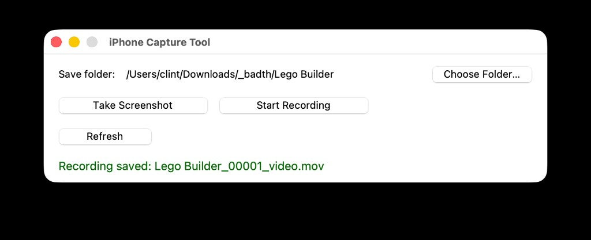

# iPhone Capture Tool

A small macOS desktop app for capturing screenshots and screen recordings from a USB-connected iPhone. Uses the same USB screen-mirror path as QuickTime — not Continuity Camera.



## Requirements

- macOS
- Python 3.9+ (system Python works: `/usr/bin/python3`)
- Xcode Command Line Tools (for `swift` and tkinter)

```bash
xcode-select --install
```

If Homebrew Python shows a tkinter error, either install tk support or use system Python:

```bash
brew install python-tk@3.14   # optional, for Homebrew Python only
/usr/bin/python3 app.py       # system Python already includes tkinter
```

## iPhone setup

1. Connect the iPhone with a USB cable (data-capable, not charge-only).
2. Unlock the phone and tap **Trust** when prompted.
3. Keep QuickTime closed while using this app — only one process can use the screen mirror at a time.

## Run

```bash
cd /path/to/streamshots
python3 app.py
```

On first launch, click **Choose Folder…** to pick where captures are saved. The path is remembered in `~/.config/iphone-capture-tool/config.json`.

## Usage

| Action | How |
|---|---|
| Screenshot | **Take Screenshot** button or **Spacebar** |
| Record | **Start Recording** / **Stop Recording** |
| Rescan device | **Refresh** |

Wait for the status line to show `Ready — [Your Phone Name]` before capturing. The first scan can take a few seconds.

## File naming

Captures use the save folder’s name with a shared incrementing counter:

```
Lego Builder_00001_pic.png
Lego Builder_00002_video.mov
Lego Builder_00003_pic.png
```

## Project files

| File | Purpose |
|---|---|
| `app.py` | Tkinter GUI and capture orchestration |
| `ios_screen_helper.swift` | Enables USB screen mirroring and handles AVFoundation capture |

## Troubleshooting

- **No iPhone detected** — Reconnect USB, unlock the phone, trust the Mac, then click **Refresh**.
- **Screenshot timed out** — Click **Refresh** and try again. The helper caches the latest frame, but the mirror must be active first.
- **Input/output error** — Another app (usually QuickTime) is using the phone feed. Quit it and **Refresh**.
- **Black screenshots** — An older version captured Continuity Camera instead of the screen mirror. Make sure you’re on the current code with `ios_screen_helper.swift`.
